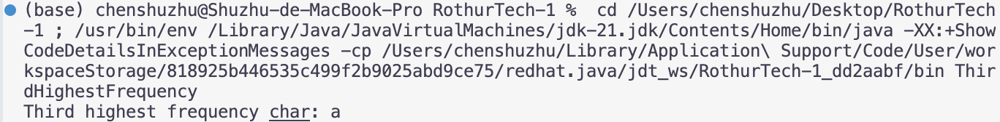
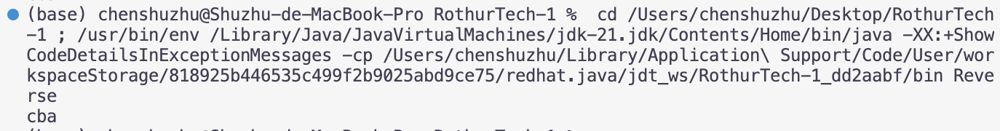
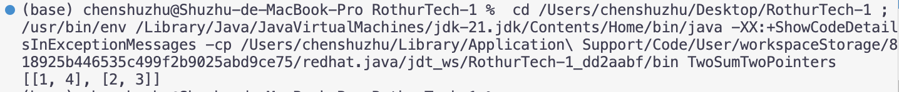

# Coding Exercise 1

## 1. Find the Character With Third Highest Frequency
Example:
input: [a, b, b, c, c, c]
output: [a]

## 2. Reverse a String
Example:
input: "abc"
output: "cba"

## 3. Find All Pairs That Sum to Target

Example:
input: [1, 2, 3, 4], target = 5
output: [[1, 4], [2, 3]]

