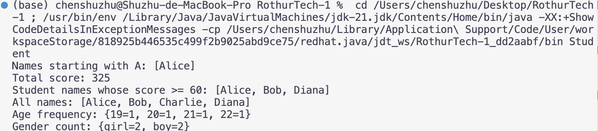
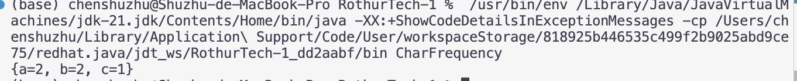

# HW4

## What Is Functional Interface?
Functional interface is an interface that has exactly one abstract method.
It can have default methods and static methods and are commonly used with lambda expressions.
Example: Runnable, Comparator, Predicate, Supplier, Consumer, Function.

## What Is Default Method?
A default method is a method in an interface that has an implementation.
It allows interfaces to add new behavior without forcing every implementation class to override it.


## Predicate vs Supplier vs Consumer vs Function
Predicate<T> takes one input and returns boolean.
Supplier<T> takes no input and returns a value.
Consumer<T> takes one input and returns nothing.
Function<T, R> takes one input and returns a result.


## write a piece of code to use the Predicate, Supplier, Consumer, Function interface
```java
Predicate<Integer> isAdult = age -> age >= 18;
Supplier<String> supplier = () -> "Hello";
Consumer<String> printer = name -> System.out.println(name);
Function<String, Integer> length = str -> str.length();

System.out.println(isAdult.test(20));
System.out.println(supplier.get());
printer.accept("Alice");
System.out.println(length.apply("Java"));
```

## What Is Method Reference?
Method reference is a shorter syntax for a lambda expression that only calls an existing method.
Common types include static method reference, instance method reference, and constructor reference.

## What Is CompletableFuture?
CompletableFuture is a Java class used for asynchronous programming.
It allows code to run tasks in the background and then process the result later.


## default Keyword vs Java Default Scope
The default keyword in an interface defines a method with an implementation.
Default scope means no access modifier is written, and the member is package-private.


## Coding: create a list of students, Student Class has name, age, score three fields. 
[Student.java](src/Student.java)


## Intermediate Operation vs Terminal Operation
Intermediate operations return another stream and are lazy. They do not execute until a terminal operation is called. Examples: map, filter, sorted, distinct.

Terminal operations produce a final result or side effect and end the stream. Examples: collect, count, forEach, reduce, sum.

## Coding: given a char array, use stream api to count the frequency of each char
[CharFrequency.java](src/CharFrequency.java)


## Stream API: map() vs flatMap()
map() transforms each element into one new element.
flatMap() transforms each element into a stream and then flattens all streams into one stream.