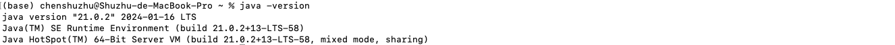
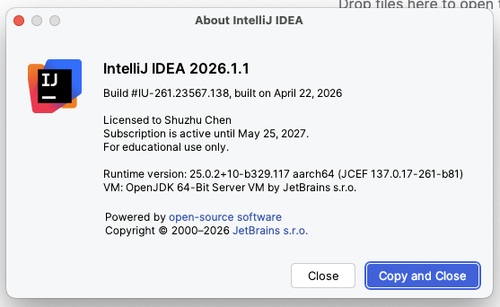
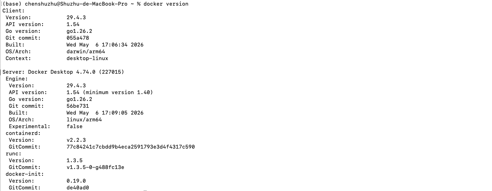
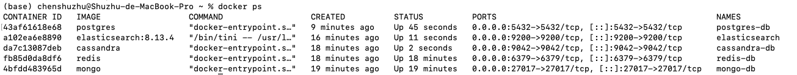
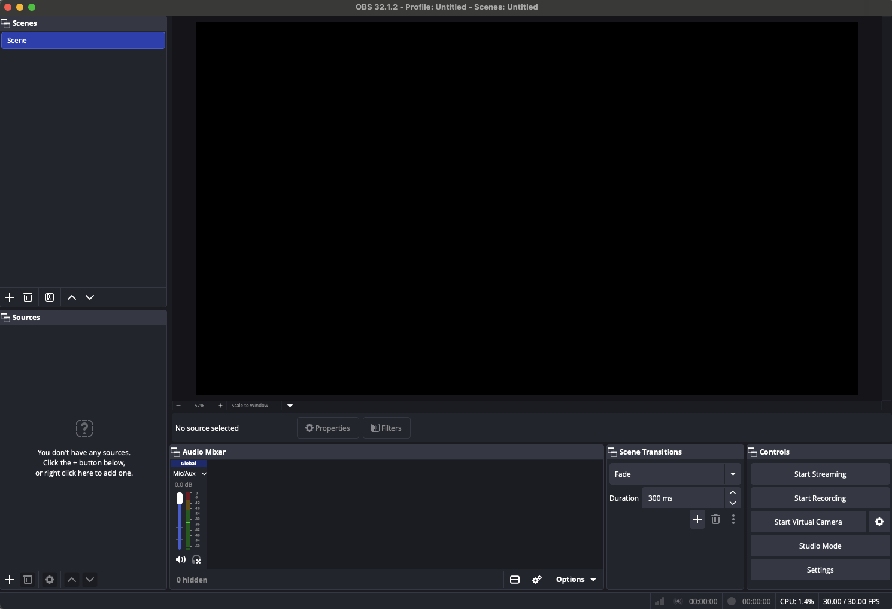
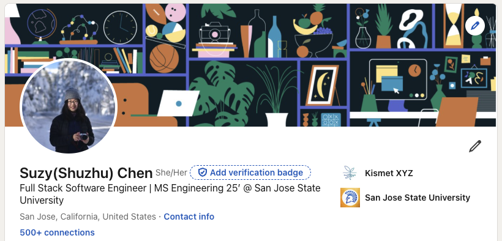
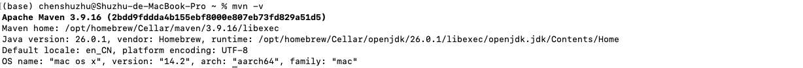
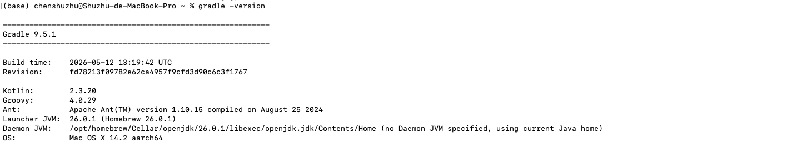
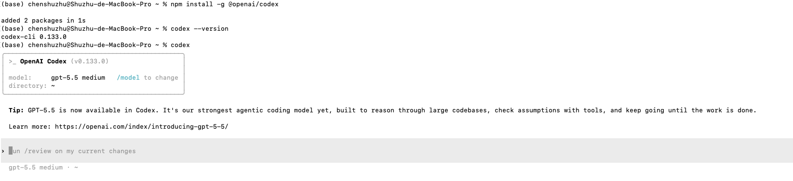

# Week 1 Onboarding Checklist

- [ ] Java 17+

- [ ] IntelliJ License -> Ultimate

- [ ] Docker

- [ ] Docker local DB

- [ ] AWS account -> S3 bucket

- [ ] Install OBS recording

- [ ] Git / GitHub account

- [ ] LinkedIn account + 20 connections

- [ ] Maven

- [ ] Gradle

- [ ] Codex CLI (any tools you prefer to)

