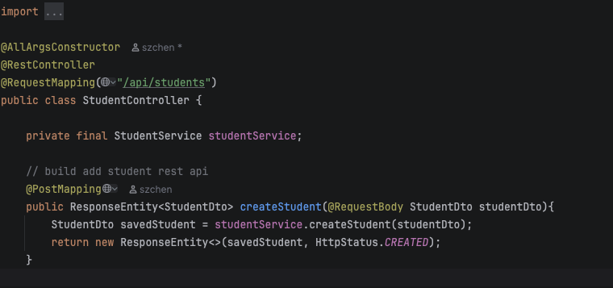

# HW9

## What is Spring IoC?
IoC means Inversion of Control. In traditional Java applications, we create objects ourselves using the `new` keyword. In Spring, object creation and lifecycle management are handled by the IoC container. Instead of creating dependencies manually, we let Spring create and manage them, and Spring provides those objects whenever they are needed. This helps reduce coupling between different classes and makes the application easier to maintain and test.

Dependency Injection is a way to achieve IoC. Instead of creating dependencies manually with the new keyword, Spring automatically injects the required dependencies into an object. For example, we can annotate classes with @Service, @Repository, or @RestController, and Spring will create and manage them as beans. If StudentController needs StudentService, we simply define it in the constructor, and Spring automatically finds the StudentService bean and injects it.

Common types of DI are constructor injection, setter injection, and field injection. In modern Spring Boot projects, constructor injection is the recommended approach.

## What is IoC Container?
IoC container is the core component of Spring that manages Spring Beans. It is responsible for creating objects, configuring them, injecting dependencies, and managing their lifecycle.

When the application starts, the container scans the project, finds the classes that should become Spring Beans, creates them, and stores them in memory for later use.

## What are the advantages of IoC?
The biggest advantage is loose coupling. Classes don't need to know how to create their dependencies. They only focus on their own responsibilities.

It also improves code reusability, maintainability, and testability. For example, if multiple controllers need the same service, Spring can create one service object and inject it wherever it's needed instead of creating multiple copies.

## What is Dependency Injection (DI)?

Dependency Injection is a way to achieve IoC. Instead of creating dependencies manually with the new keyword, Spring automatically injects the required dependencies into an object. For example, we can annotate classes with @Service, @Repository, or @RestController, and Spring will create and manage them as beans. If StudentController needs StudentService, we simply define it in the constructor, and Spring automatically finds the StudentService bean and injects it.

Common types of DI are constructor injection, setter injection, and field injection. In modern Spring Boot projects, constructor injection is the recommended approach.

## 5. write a demo code to show what is Dependency Injection (give screenshot)

Here with constructor injection, Spring automatically injects the StudentService bean into StudentController.

## What are the different types of Dependency Injection?
3 types. Constructor Injection, Setter Injection, and Field Injection.

Constructor injection means passing dependencies into a class through its constructor. It is the recommended approach because dependencies are required, easier to test, and cannot be null.

Setter injection means using a setter method to inject dependencies after the object is created. It is useful for optional dependencies, but constructor injection is usually preferred for required dependencies.

Field injection means putting @Autowired directly on a field. It requires less code, but it makes unit testing harder because we cannot easily pass mock dependencies into the object.

In real projects, I usually use constructor injection because it follows Spring Boot best practices.

## @Component vs @Bean
Both are used to register objects as Spring Beans.

@Component is used directly on a class. Spring automatically discovers it during component scanning.

@Bean is used on a method inside a configuration class. I usually use @Bean when I need to register a third-party class that I cannot modify.

## What is @Configuration?
@Configuration tells Spring that the class contains bean definitions.

Spring will process the methods inside the class and register any objects returned by methods annotated with @Bean. It's commonly used for custom application configuration.

## What is @ComponentScan?
@ComponentScan tells Spring where to look for classes annotated with @Component, @Service, @Repository, and @Controller

Spring automatically creates beans for those classes and registers them in the IoC container. Without component scanning, Spring would not know which classes should become Spring Beans.

## @Controller vs @RestController
@Controller is used for traditional Spring MVC applications that return HTML pages or view names.

@RestController is used for REST APIs, and its methods automatically return JSON data instead of view names.

@RestController is basically @Controller plus @ResponseBody, so the return value is written directly to the HTTP response body instead of being resolved as a view.

## @Controller vs @Service vs @Repository
All three are Spring stereotype annotations and are managed as Spring Beans. The difference is their responsibility.

@Controller handles HTTP requests and responses.

@Service contains business logic and processes employee-related operations.

@Repository handles database access and executes database queries and CRUD operations.

## What is Bean Scope?

Bean scope defines how many instances of a bean Spring creates and how long they live. Spring provides six bean scopes: Singleton, Prototype, Request, Session, Application, and WebSocket. The most commonly used scopes are Singleton and Prototype.

Singleton is the default scope in Spring. Spring creates only one bean instance for the entire Spring container, and the same instance is reused wherever it is injected.

Prototype scope means Spring creates a new bean instance every time the bean is requested from the Spring container. We can use @Scope("prototype") to make a bean prototype-scoped.

Request scope means Spring creates one bean instance for each HTTP request, and the bean is destroyed when the request is completed.

Session scope means Spring creates one bean instance for each HTTP session and keeps it alive until the session ends.

Application scope means Spring creates one bean instance for the entire web application, and all users share the same instance.

WebSocket scope means Spring creates one bean instance for each WebSocket session and keeps it alive as long as the WebSocket connection exists.

## Singleton vs Prototype

Singleton means only one object is created for the entire application. Every class that requests the bean gets the same instance.

Prototype scope means Spring creates a new bean instance every time the bean is requested from the Spring container. We can use @Scope("prototype") to make a bean prototype-scoped.

## give me 3 uses cases for each of singleton, prototype, request and session bean scope
Singleton scope is the default scope in Spring. Spring creates only one bean instance for the entire Spring container, and the same instance is reused wherever it is injected. Common use cases include service classes, repository classes, and configuration classes because these components are usually stateless and can be shared safely across the application.

Prototype scope means Spring creates a new bean instance every time the bean is requested from the Spring container. Common use cases include report generators, file parsers, and data processing tasks, where each operation needs its own object instance and temporary state.

Request scope means Spring creates one bean instance for each HTTP request, and the bean is destroyed when the request is completed. Common use cases include storing request tracking IDs, request-specific user information, and temporary data that is only needed during a single API call.

Session scope means Spring creates one bean instance for each HTTP session and keeps it alive until the session ends. Common use cases include shopping carts, logged-in user information, and multi-step form data that needs to be shared across multiple requests from the same user.

## Session vs Cookie
The main difference is where the data is stored.

Cookie stores data in the browser. Data is sent to the server with each request. It stores small amounts of data like preferences or session IDs.

Session stored data on the server. It's more secure than cookies and stores user-specific information such as login status or shopping cart data.

In most web applications, the browser stores a Session ID inside a cookie, and the server uses that Session ID to find the correct session data.
