## sql vs no sql database
SQL database is relational database. it stores data in structured tables with predefined schemas. it suppors SQL queries, joins, aggregations, and strong ACID transactions.

NoSQL database supports more flexible data models, such as key-value, document, column-family, and graph models. They are often designed for horizontal scaling and distributed systems.

SQL databases are usually preferred for transactional systems such as orders, payments, and account management, where consistency is critical.

NoSQL databases are commonly used for caching, logging, session storage, and large-scale distributed applications that require high throughput and scalability.

In the projects I've been working on, SQL and NoSQL are often used together. For example, MySQL may store core business data, while Redis is used as a cache layer to improve performance.

## what is database normalization
Database normalization is the process of organizing database tables to reduce data redundancy and improve data consistency.

The First Normal Form requires each field to contain only a single value.

The Second Normal Form removes partial dependencies on composite keys.

The Third Normal Form removes transitive dependencies, where one non-key column can be derived from another non-key column.

Normalization helps prevent insertion, update, and deletion anomalies.

However, normalization is not always better. Excessive normalization may require many table joins and hurt query performance, so denormalization is sometimes used as a trade-off to improve performance.

## vertical scaling vs horizontal
Vertical scaling means increasing the resources of a single server, such as CPU, memory, or storage. Horizontal scaling means adding more servers and distributing traffic across multiple nodes.

Vertical scaling is simpler to implement but is limited by the maximum capacity of one machine and may create a single point of failure.

Horizontal scaling requires load balancing and distributed system design, but it provides better scalability, fault tolerance, and high availability.

Horizontal scaling is usually preferred because user traffic can grow rapidly and multiple servers can process requests in parallel.

## what is ACID
ACID represents four properties that guarantee reliable database transactions.(Atomicity, Consistency, Isolation, Durability)

1. Atomicity means all operations in a transaction succeed together or fail together.

2. Consistency means the database remains in a valid state before and after a transaction.

3. Isolation means concurrent transactions do not interfere with each other.

4. Durability means once a transaction is committed, the data will persist even if the system crashes.

## what is CAP
CAP stands for Consistency, Availability, and Partition Tolerance.

1. Consistency means every node sees the same data at the same time.

2. Availability means every request receives a response, even if the returned data may not be the latest version.

3. Partition Tolerance means the system continues operating even when communication between nodes is interrupted.

CAP theorem states that in a distributed system, it is impossible to simultaneously guarantee Consistency, Availability, and Partition Tolerance. We can only choose two of the three.

As a result, many distributed databases are either:
a. CP systems, which prioritize consistency, such as MongoDB and ZooKeeper.
b. AP systems, which prioritize availability, such as Cassandra and DynamoDB.

## sql query practice: (submit screenshot) (PostgreSQL console)

a. create Employee(key, name, dept, age) and Department(key, name) Table
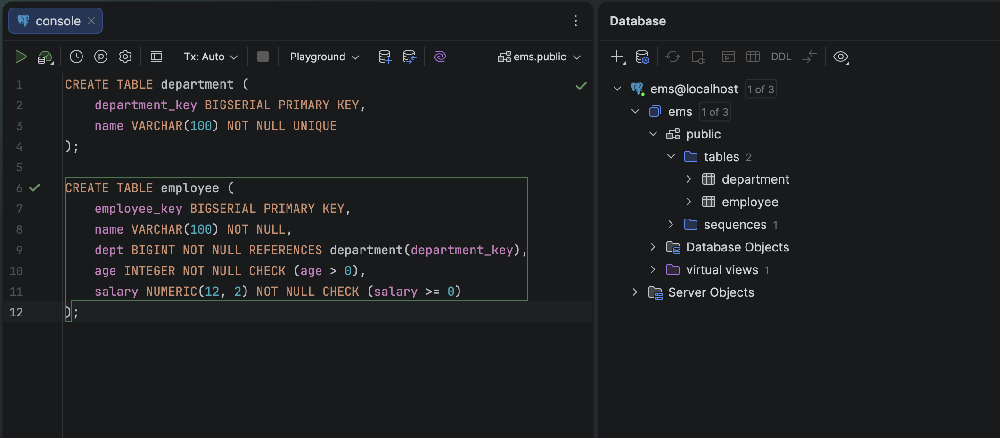

b. insert some dummy data
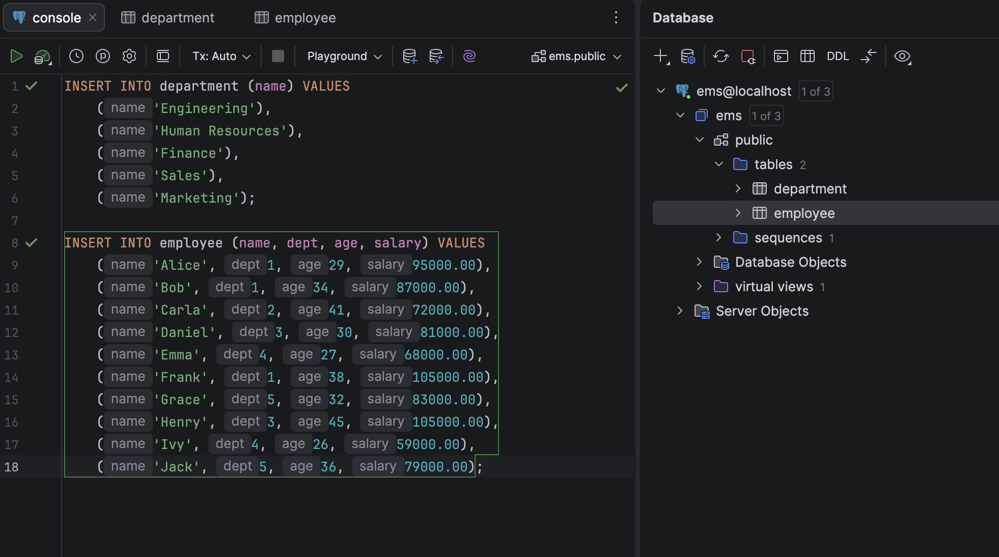

### query the data

1. Get only employee names and ages.
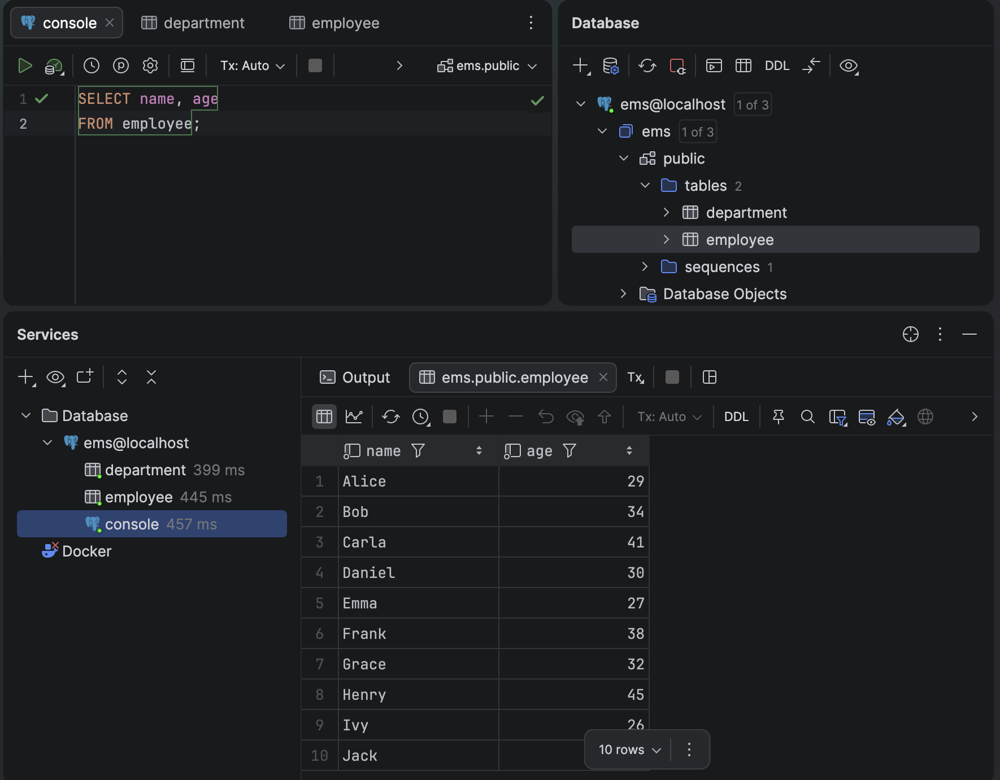

2. Find employees older than 30.
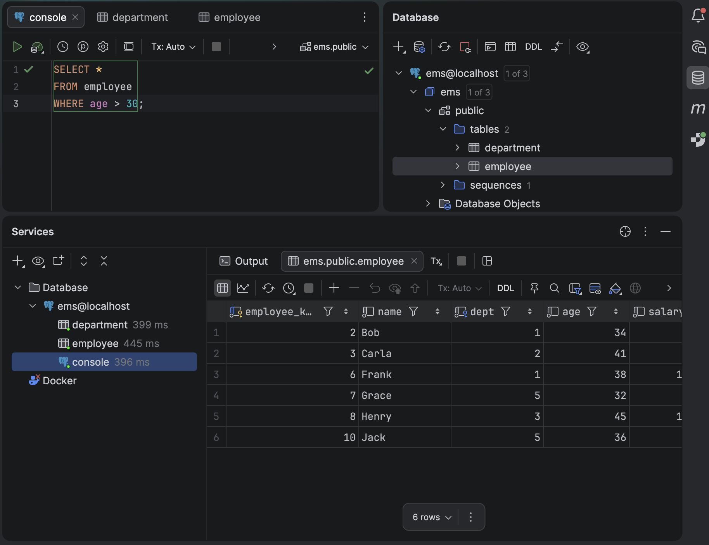

3. Find employees whose salary is greater than 80,000.
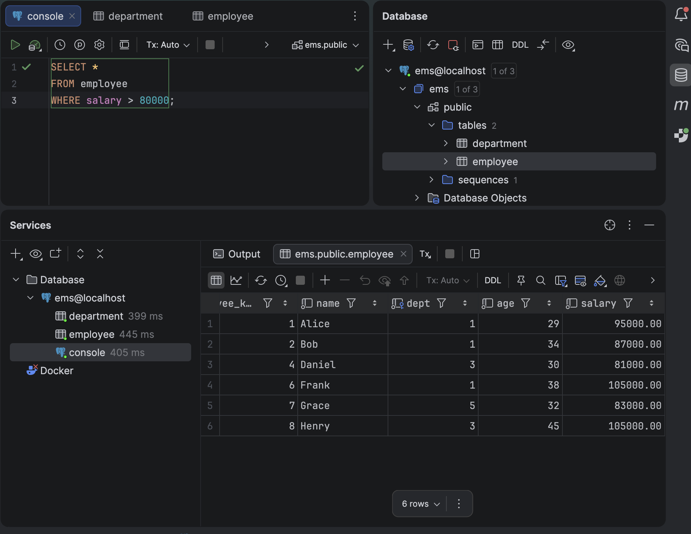

4. List employees ordered by age (ascending).
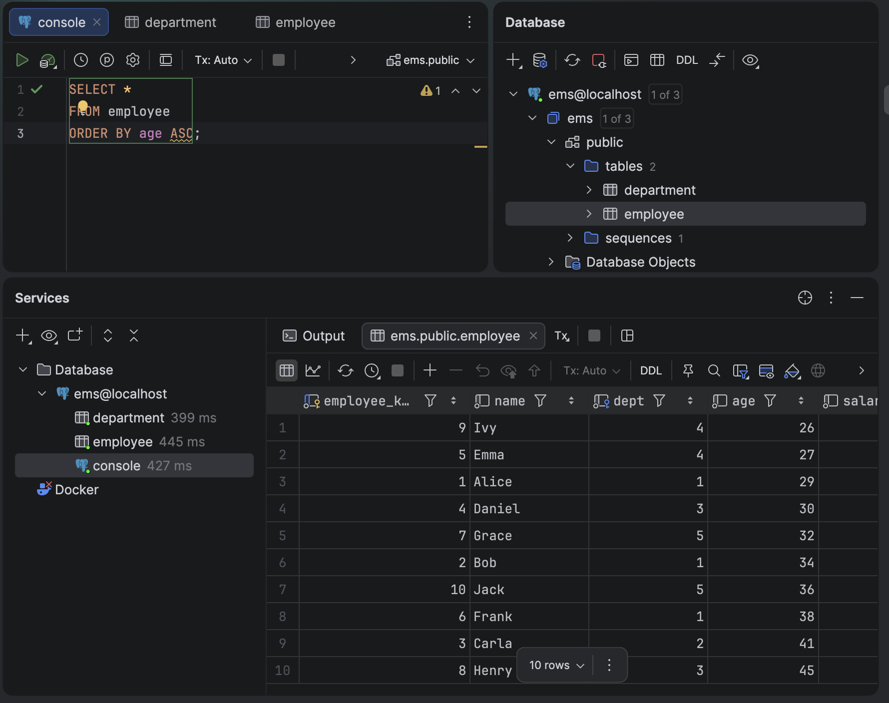

5. Get the top 3 highest-paid employees.
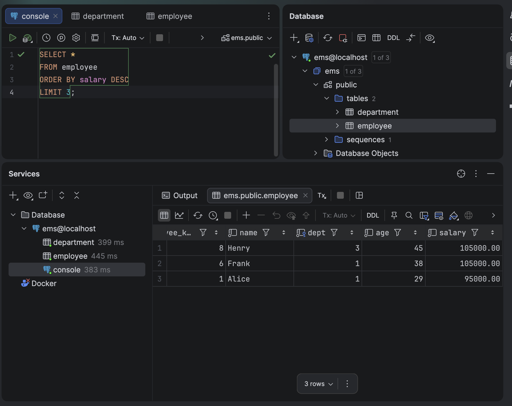

6. Count total number of employees.
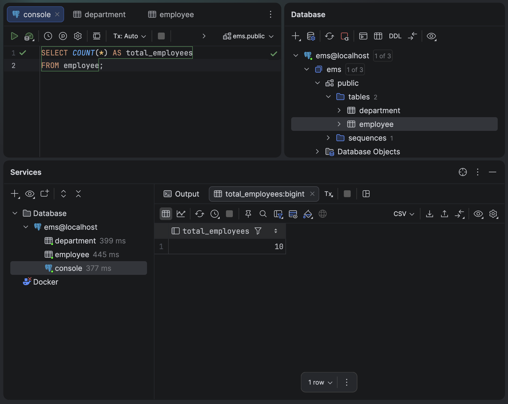

7. Find the average salary of all employees.
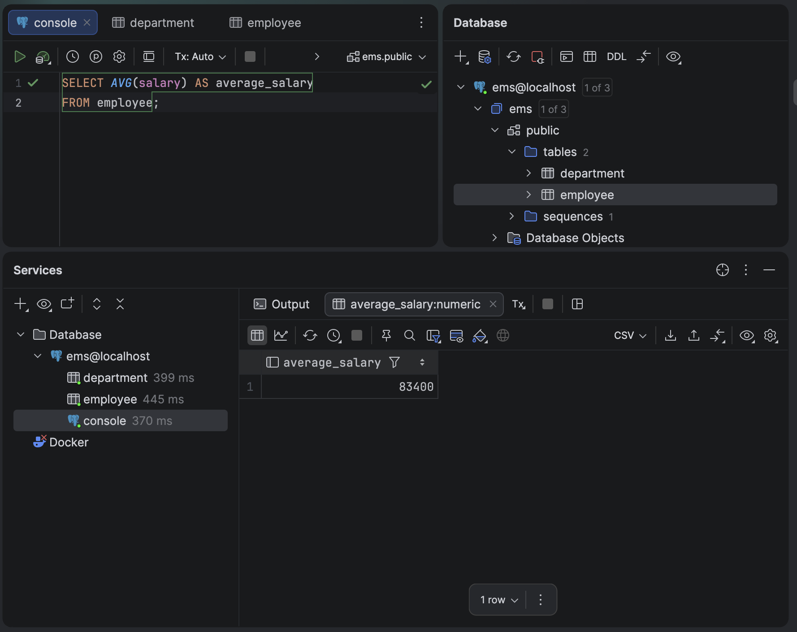

8. List employee name with department name.
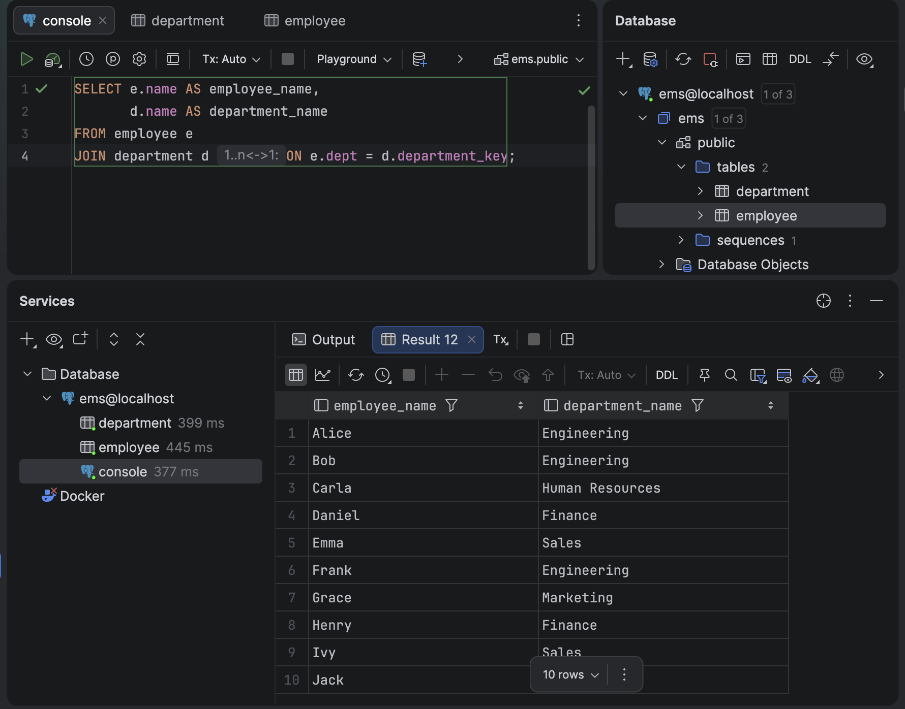

9. Find employees earning the highest salary.
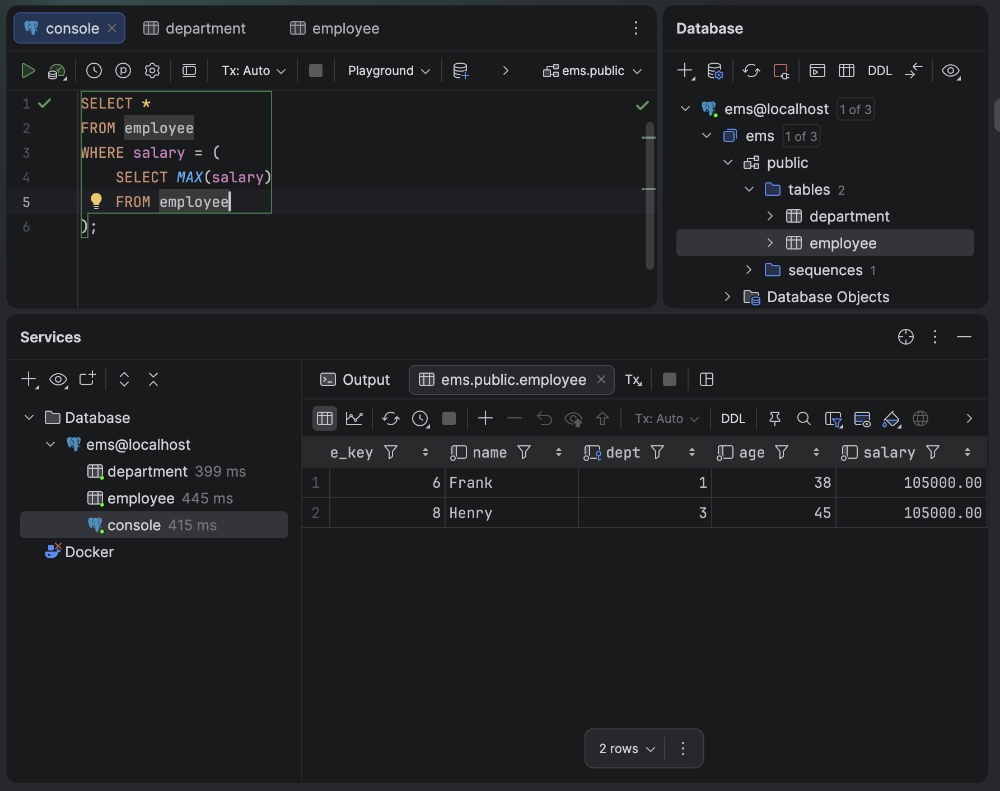

10. Find employees earning the second highest salary.
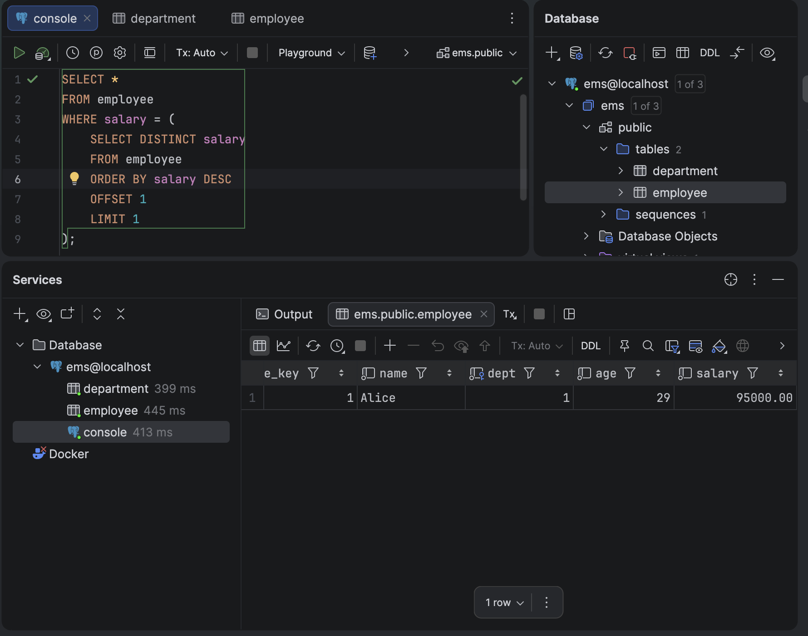

11. Find employees earning the third highest salary.
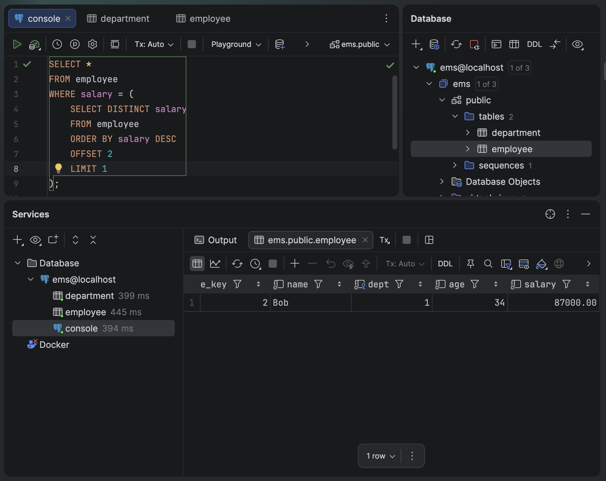