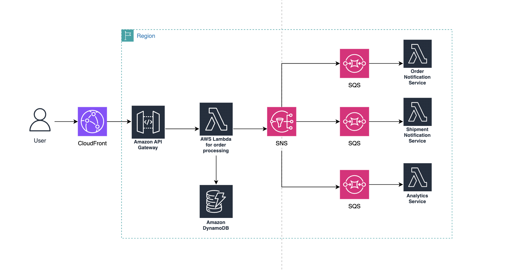
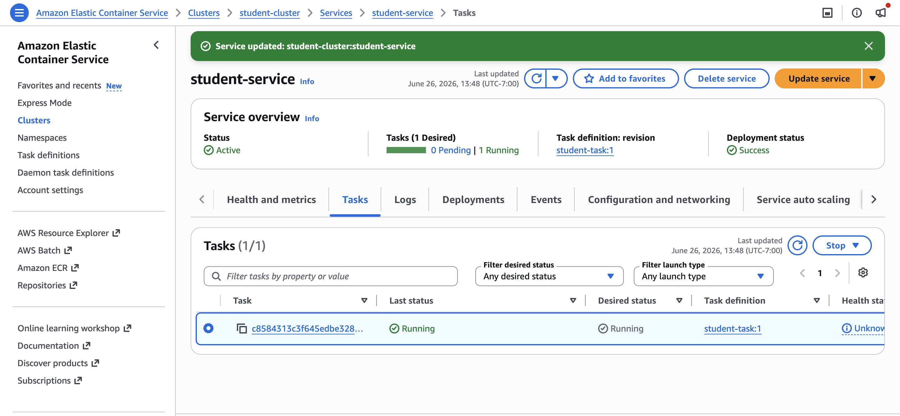
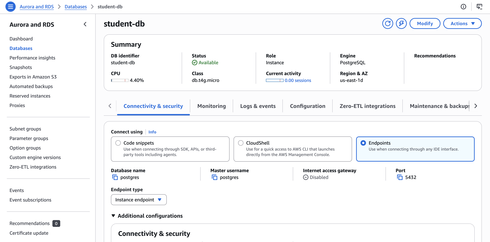
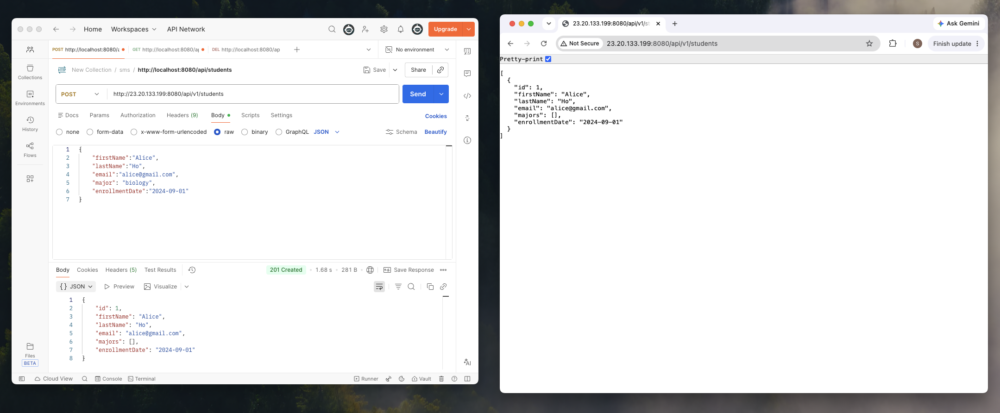

# hw 17

## what is docker, dockerfile, docker image, docker container
Docker is a platform that packages an application and all its dependencies into containers, so the application can run consistently across different environments.

A Dockerfile is a text file that defines how to build a Docker image. It contains instructions: what base OS/runtime to use, what dependencies to install, what files to copy, what command to run

Docker Image is the compiled artifact. It is an immutable, read-only template composed of stacked layers representing your application, its runtime, libraries, and environment variables. It cannot be run directly; it must be instantiated.

Docker Container is the running process. It is a live, isolated, runnable instance of a Docker image. It adds a thin writeable layer on top of the immutable image layers, allowing it to modify files during runtime.

## docker vs VM
The main difference lies in their architectural abstraction: Docker isolates the process, while VMs isolate the hardware.

Docker virtualizes the operating system, while VMs virtualize the physical hardware. Because Docker containers share the host machine's OS kernel and isolate applications at the process level, they are incredibly lightweight, require only megabytes of space, and can boot up in seconds. 

In contrast, Virtual Machines run a complete, heavy guest operating system on top of a hypervisor; while this provides strict, highly secure hardware-level isolation, it also demands dedicated CPU, RAM, and storage, resulting in gigabyte-sized artifacts and significantly slower boot times.

## talk about how to use docker in real project
In a production environment, Docker is integrated across the entire Software Development Lifecycle (SDLC):

1. Local Development: Instead of forcing developers to manually install specific versions of Node.js, Python, or PostgreSQL, we use a docker-compose.yml file. A developer runs a single command—docker compose up—and spins up the entire application stack locally, ensuring absolute parity between dev environments.

2. CI/CD Pipelines: When code is pushed to Git, the CI/CD pipeline (e.g., GitHub Actions, GitLab CI) reads the Dockerfile, builds the image, runs automated tests inside the container, and pushes the verified image to a registry. This guarantees that what we tested in CI is exactly what gets deployed to production.

3. Microservices Scaling & Deployment: In production, we deploy these images to orchestrators like Kubernetes or AWS ECS. If traffic spikes, the orchestrator can spin up 10 more instances of the container in seconds because they don't have the heavy boot-time overhead of traditional VMs.

## check the following AWS Services and how to use them in project

1. EC2 (Elastic Compute Cloud): Raw, resizable virtual servers (VMs) in the cloud. It's used when I need full control over the underlying operating system, kernel configurations, or when running legacy software that isn't containerized.

2. ECR (Elastic Container Registry): A secure, managed Docker container registry. This is where our CI/CD pipeline pushes our compiled Docker images. AWS ECS or Lambda then pulls images directly from ECR to run them in production.

3. ECS (Elastic Container Service): A highly scalable, fast container management/orchestration service. This is where our production Docker containers actually live. We use ECS with AWS Fargate (serverless compute for containers) to run our microservices web APIs, worker tasks, and background crons without managing actual EC2 servers.

4. RDS (Relational Database Service): A managed relational database service supporting PostgreSQL, MySQL, SQL Server, and Oracle. It's used as our primary transactional database (OLTP) where structured data, acid compliance, and complex SQL joins are required—such as managing user profiles, financial transactions, or order histories.

5. DocumentDB: A managed, fast, scalable MongoDB-compatible NoSQL database. It's used when the application handles semi-structured document data (JSON) that has a dynamic schema, such as a product catalog with varying attributes or user content management systems.

6. DynamoDB: A fully managed, serverless, single-digit millisecond latency Key-Value and Document NoSQL database. It's used for high-throughput, massive-scale scenarios where predictable performance is critical. Excellent for shopping carts, user session storage, IoT data ingestion, or leaderboard systems.

7. Lambda Function: A serverless, event-driven compute service. Perfect for short-lived, ephemeral tasks. For example, processing uploaded images in an S3 bucket (generating thumbnails), handling webhook notifications, or running lightweight cron jobs.

8. API Gateway: A managed service that makes it easy for developers to create, publish, maintain, and secure APIs at scale. It acts as the entry point for our frontend application. It handles routing, SSL termination, rate limiting (throttling malicious traffic), and user authentication before passing the request down to our backend Lambda functions or ECS microservices.

9. AWS Kinesis: A managed real-time data streaming service. It's used for processing massive volumes of real-time data streaming in simultaneously. For example, capturing real-time user clickstream analytics from a high-traffic website or ingesting continuous logs and metrics for anomaly detection.

10. IAM (Identity and Access Management): The security framework that manages access to AWS services and resources securely. Can be used to enforce the Principle of Least Privilege. We create specific IAM Roles for our ECS tasks or Lambda functions so they only have permission to access the exact resources they need (e.g., a specific S3 bucket or DynamoDB table), ensuring no cross-contamination or security leaks.

11. SNS (Simple Notification Service) vs. SQS (Simple Queue Service): 
Both are frequently used together to build asynchronous, decoupled microservices.

    SNS (Pub/Sub): A push-based messaging service. An event happens (e.g., OrderPlaced), and SNS immediately broadcasts (fans out) that message to multiple subscribers.

    SQS (Message Queue): A pull-based queueing service. It holds messages until a worker process pulls them off the queue, processes them, and deletes them. It guarantees that if your worker goes down, messages aren't lost.

    For example, when a user buys an item, the API publishes an OrderPlaced event to SNS. SNS pushes this single message to three separate SQS queues simultaneously: one for the Inventory Service queue, one for the Shipping Service queue, and one for the Email Notification Service queue. Each microservice processes its queue independently and at its own pace.

## design online shopping system, only use aws services and draw the architecture

## deploy the springboot project on AWS(EC2 or ECS)

ECS link: http://23.20.133.199:8080/api/v1/students

